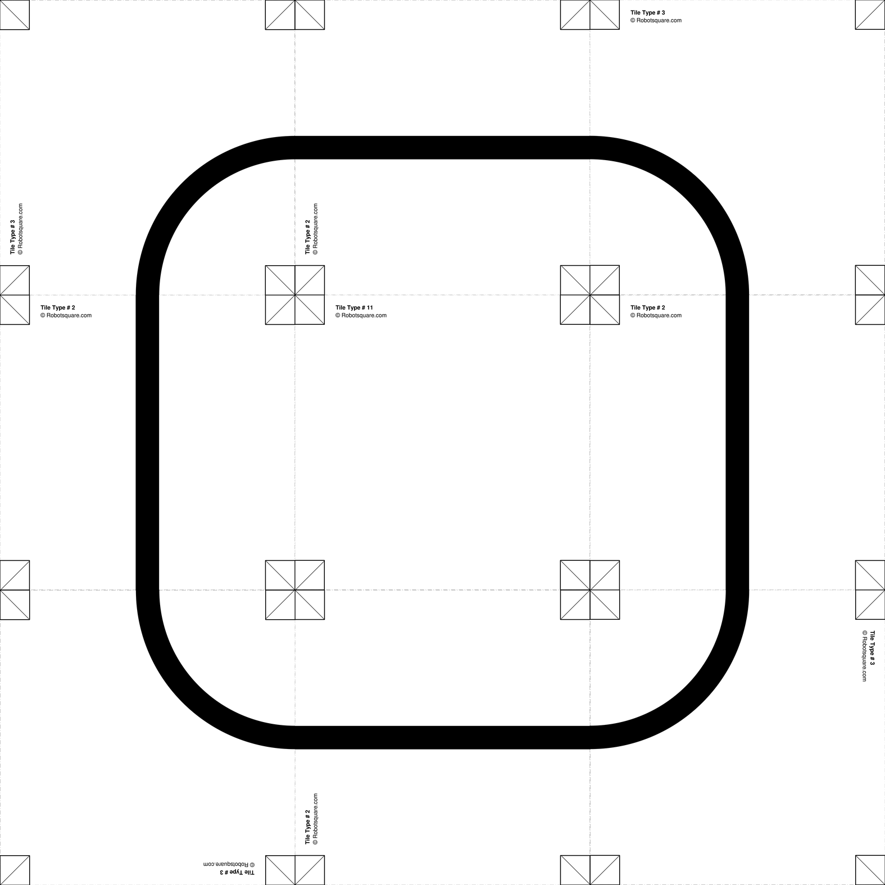

Quickstart
==========

Main idea
---------
The main idea of *Line Track Designer* is to build tracks easily that you can **edit**,
**save**, **share** and **print** with a printer.

To do that, different **tiles** are used and can be associated like a puzzle.
This tiles originate from a PDF file and can be printed in A4 format.
This tiles are squares of 200 mm. They are represented by a number between 2 and 33.

You can see all the tiles here: :download:`pdf <pdf/linefollowtiles.pdf>`

A track is represented by two matrix
:math:`T` and :math:`O`:

* :math:`T` contains the number of each tile of the track
* :math:`O` indicates the orientation of each tile

A correct orientation is 0, 1, 2 or 3 which corresponds to the number
of times the tile is rotated by 90 degrees.

For example, we consider the following matrix:

.. math ::

    T =
    \begin{pmatrix}
        3 & 2 & 3 \\
        2 & 11 & 2 \\
        3 & 2 & 3
    \end{pmatrix}

.. math ::

    O =
    \begin{pmatrix}
        1 & 1 & 0 \\
        0 & 0 & 0 \\
        2 & 1 & 3
    \end{pmatrix}

The track associated to this two matrix is:

**Tracks** are stocked in **text files**. The two matrix are "superposed" like this:

.. code-block:: text

    3;1 2;1 3;0
    2;0 11;0 2;0
    3;2 2;1 3;3

Create your first track
-----------------------
This is how to build the track above with *Line Track Designer*:

1. Create en empty track ``track.txt`` with 3 rows and 3 columns:

.. code-block:: bash

    linetrack create track.txt 3 3

You should arrive in your default text editor with this content:

.. code-block:: text

    0;0 0;0 0;0
    0;0 0;0 0;0
    0;0 0;0 0;0

2. Change the numbers so that it looks like this:

.. code-block:: text

    3;1 2;1 3;0
    2;0 11;0 2;0
    3;2 2;1 3;3

3. Save the modifications and quit the text editor.

4. You can show the track as image using:

.. code-block:: bash

    linetrack show track.txt

It will display the track in your picture reader.

5. Generate the markdown file associated to the track with:

.. code-block:: bash

    linetrack savemd track.txt

The program asks the name of the track and its description.
The file ``track.md`` should be created. You can convert the markdown file
into PDF or HTML. This is the result:
:download:`pdf <pdf/track.pdf>`

You can also create exactly the same files using a Python script with
the API of *Line Track Designer*:

.. code-block:: python

    import numpy as np
    from line_track_designer.track import Track

    # Arrays for the track
    tiles = np.array([
        [3, 2, 3],
        [2, 11, 2],
        [3, 2, 3]
    ])
    orient = np.array([
        [1, 1, 0],
        [0, 0, 0],
        [2, 1, 3]
    ])

    # Creation of the track
    track = Track(tiles, orient, 'Test track')

    # Save the track
    track.save_txt('track.txt')
    track.save_img('track.png')
    # Make markdown file
    track.save_md('track.md', 'track.png', 'Easy track')
